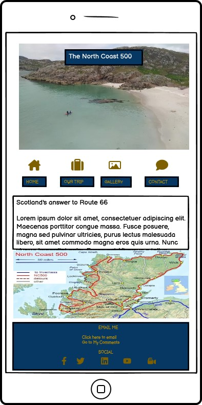
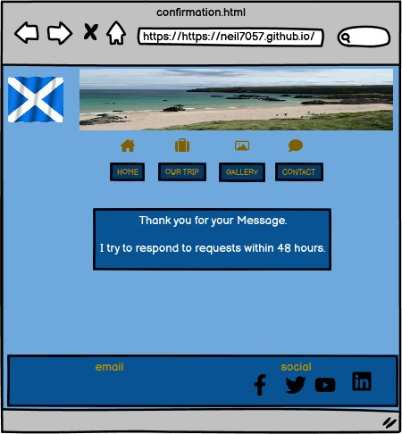
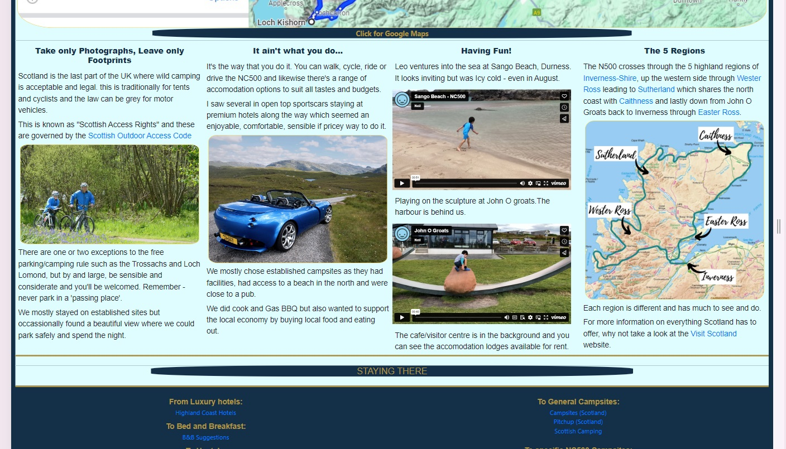
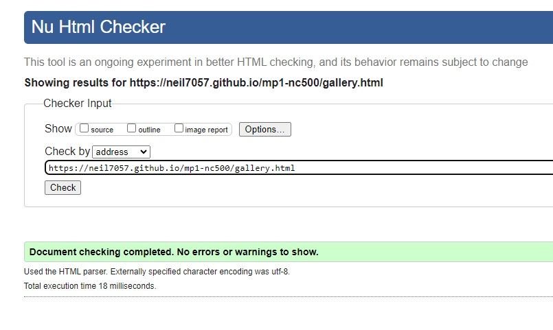
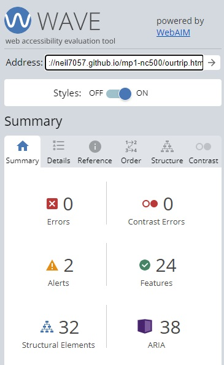
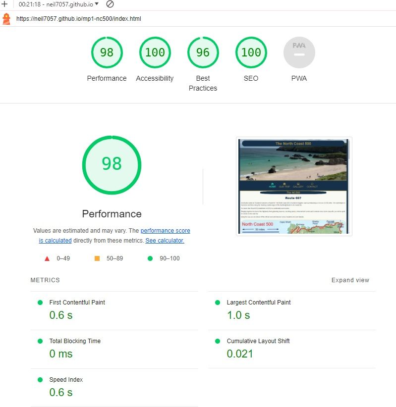
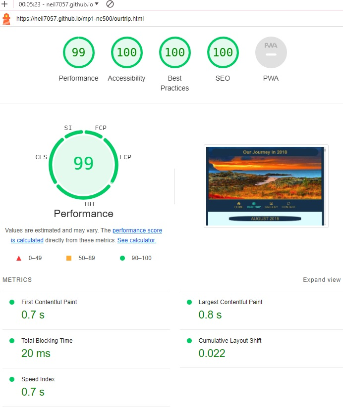

# My North Coast 500 Website


**Author Neil Allen**

## The North Coast 500

This is my website documenting our family trip around the NC500 in 2018. It is designed to be responsive and accessible on a range of devices, making it easy to navigate for those new to the NC500 and those wishing to learn more.

It is designed to appeal to those who have never heard of the North Coast 500 and wish to find out more. It is also designed to appeal to those who are already aware of the route and are interested in reading about a fellow traveller's journey or are looking for inspiration.

The site will also appeal to those looking for imagery of the area and/or links to related content and services.  

[View the live project here.](https://neil7057.github.io/mp1-nc500/)

# Table of Contents

1. [Project Inception and Planning](#project-inception-and-planning)
2. [User Experience (UX)](#user-experience-ux)
    *   [User stories](#user-stories)
        *   [First Time Visitor Goals](#first-time-visitor-goals)
        *   [Returning Visitor Goals](#returning-visitor-goals)
        *   [Frequent User Goals](#frequent-user-goals)
    *   [Design](#design)
        *   [Colour Scheme](#colour-scheme)
        *   [Typography](#typography)
        *   [Imagery](#imagery)
        *  [Design Considerations](#design-considerations)
    *   [Wireframes](#wireframes)
    *   [Structure](#structure)
3. [Features](#features)
    *   [Landing Page](#landing-page)
    *   [Our Trip Page](#our-trip-page)
    *   [Gallery Page](#gallery-page)
    *   [Contact Page](#contact-page)
    *   [Confirmation Page](#confirmation-page)
    *   [Error 404 Page](#error-404-page)
4. [Technologies Used](#technologies-used)
    *   [Development Environment](#development-environment)
    *   [Languages Used](#languages-used)
    *   [Frameworks, Libraries & Programs Used](#frameworks-libraries--programs-used)
5. [Testing](#testing)
    *   [HTML](#html)
    *   [CSS](#css)
    *   [Testing User Stories from User Experience (UX) Section](#testing-user-stories-from-user-experience-ux-section)
        *   [First Time Visitor Goals](#first-time-visitor-goals-1)
        *   [Returning Visitor Goals](#returning-visitor-goals-1)
        *   [Frequent User Goals](#frequent-user-goals-1)
    *   [Responsiveness](#responsiveness)
    *   [Accessibility](#accessibility)
    *   [Screen Reader](#screen-reader)
    *   [Lighthouse Testing](#lighthouse-testing)
    *   [Functional Testing](#functional-testing)
    *   [Further Testing](#further-testing)
    *   [404 Error Testing](#404-error-testing)
    *   [Known Bugs](#known-bugs)
6. [Deployment](#deployment)
    *   [Version control](#version-control)
    *   [Github Pages](#github-pages)
    *   [Deployments to Github Pages](#deployment-to-github-pages)
    *   [Clone the repository locally](#clone-the-repository-code-locally)
7. [Credits](#credits)
    *   [Code](#code)
    *   [Content](#content)
    *   [Media](#media)
    *   [Acknowledgements](#acknowledgements)

## Project Inception and Planning

## User Experience (UX)

-   ### User stories

    -   #### First Time Visitor Goals

        1. As a First Time Visitor, I want to easily understand what and where the North Coast 500 is.
        2. As a First Time Visitor, I want to be able to easily navigate throughout the site to find content.
        3. As a First Time Visitor, I want to read about an actual trip around the NC500 and look at interesting images.

    -   #### Returning Visitor Goals

        1. As a Returning Visitor, I want to find more information that may help me plan a trip.
        2. As a Returning Visitor, I want to find the best way to get in contact and ask for help and advice with any questions I may have.
        3. As a Returning Visitor, I want to find links to other resources that will help me plan.

    -   #### Frequent User Goals
        1. As a Frequent User, I want to check to see if there are any newly added photographs.
        2. As a Frequent User, I want to check to see if there is any new information.
        3. As a Frequent User, I want to check to see if there are any new links.

-   ### Design
    -   #### Colour Scheme
        -   To fit in with the main colours of the Scottish Flag (Saltire), i've chosen blue as the colour scheme for the site with a contrast between a dark blue for menu items and footer, and a sandy colour to represent the stunning beaches as background. I've added a contrasting bronze as this looks good. I have added a green highlight to the current page icon.

        -   On some pages i've also added a light blue to soften the screen and ensure WCAG contrast compliance. Hyperlinks have been coloured to provide a contrast compatible with WCAG guidelines.
        
    -   #### Typography
        -   The Baskerville Libre font is the main font used for headings and Open Sans is used for other text consistently throughout the whole website. Sans Serif is the fallback font in case for any reason the font isn't being imported into the site correctly. Baskeville is a clean font and looks crisp on blue or a white background. It is both elegant and professional.

    -   #### Imagery
        -   Imagery is important. The NC500 is especially famous for its views and scenery so this requires a large, background hero image designed to be striking and catch the user's attention. It is essential that the site has a gallery area to fully communicate the variety of the NC500's scenic experiences.

        -   The site is image rich as that is a key feature of the NC500. Most images are my own, with some copyright free images and attribution where required.


    -   #### Design Considerations
        -   The header of each page carries a different Hero or banner image but other items remain consistent. The Footer is minimalist as its not necessary to give out extensive contact information. There's an email option, a link to the main contact page and form and 5 social media links.

        -   Larger screen sizes have the waving saltire gif but this is hidden on smaller screens as it occupies too much space whilst adding little value. 

        -   The site is responsive with some items hidden or resized for smaller screens.

        -   Menu navigation remains in the centre of the screen on all viewing sizes and is at optimum eye height.

        -   There is a customised error-404 page 'just in case'.

-   ### Wireframes

    <details><summary>Home - Desktop</summary>
    
    </details>
    <br>
    <details><summary>Home - Mobile</summary>
    
    </details>
    <br>
    <details><summary>Home - Tablet</summary>
    
    </details>
    <br>
    <details><summary>Our Trip Page</summary>
    
    </details>
    <br>
    <details><summary>Gallery Page</summary>
    
    </details>
    <br>
    <details><summary>Contact Page</summary>
    
    </details>
    <br>
    <details><summary>Contact Confirmation Page</summary>
    
    </details>
    <br>
    <details><summary>404 Error Page</summary>
    
    </details>
 
-   ### **Structure**

    The structure of the site is informed by the the target audience's expectations and the principles of IXD (interaction design) to make sure I was making everything as intuitive as I could.


    The site has a simple structure made up of 4 pages:
    * Homepage - a short introduction to what the North Coast 500 is.
    * Our Trip - Specific information and images about our journey around the NC500 in
     August 2018.
    * Gallery - A range of images to show the variety and beauty of the NC500 route
    * Comments - A form to allow the user to send comments or requests for further information.

    * There are also 2 additional sub pages
        -   A Confirmation thank you page for when a user has submitted a form
        -   A 404 page for when a user lands on a non-existent page

    The site has a navbar which remains central to the screen on desktop, tablet and mobile, this allows a user to access any page they need at any time and is suitable for a first time or returning visitor. There is also a footer on every page with links to social media sites, the Comments page and a direct email link.

## Features

-   Responsive on all device sizes down to 280px - the industry standard minimum screen width.

-   Interactive elements

-   Active menu page is highlighted in Green on menu options and menu items enlarge on Hover.
    <details><summary>Navigation Menu</summary>
    
    </details>
    <br>
-   In addition to a contact form option, there is a direct email link.
    <details><summary>Contact</summary>
    
    </details>
    <br>
-  Scrolling text box with help text on comments page.
    <details><summary>Comments Text Box</summary>
    
    </details>

### Landing Page
* Landing page image
    * This will be a sample image representing an aspect of the NC500 route and scenery.
    * On larger screen sizes there is an animated waving Saltire. 
    * This will help to immediately show the user what the website is about. 

    <details><summary>Landing Page</summary>
    
    </details>
    <br>

* North Coast 500 information and introduction on the landing page.
    * A large map of the NC500 route.
    * Some sample images and 5 paragraphs of informative text.
    * This information lets the user know what the site is about and gives a visual representation of the route. 

     <details><summary>Homepage Details</summary>
    
    </details>
    <br>

### Our Trip Page
* Our Trip
    * A brief day by day breakdown of the route.
    * An image for each location with an icon to indicate if it was an overnight stop.
    * A map of the route identifying the 5 regions.
    * Video of the beach and John O Groats.
    * Links to useful resources.   

    <details><summary>Our Trip Page</summary>
    
    </details>
    <br>
    <details><summary>Our Trip details</summary>
    
    </details>

### Gallery Page
* Gallery
    * A selection of images which spread across the screen in a resposnsive style.
    * Clicking on a thumbnail image opens a larger version in full screen with navigation backwards and forwards and an autoplay function. 
    * The code requires Java script and is not my own. It was obtained from https://nanogallery.brisbois.fr/. 
    * I added the functionality of a label to the Thumbnail and enlarged image.
    * I created thumbnail images for all main images.
    * I changed the colour scheme of the icons to match the rest of the site. 
    * I created a small additional CSS file to manipulate IMG properties for this page alone. 

    <details><summary>Gallery Page</summary>
    
    </details>

### Contact Page
* Contact form
    * A contact form will be implemented to allow users to contact me. The form will consist of the following fields and attributes: 
        * First Name (required, type=text)
        * Last Name (required, type=text)
        * Email (required, type=email)
        * Message (required, type=textarea), maximum 280 characters
    * Muted Text will be used as hints or for assurance on certain fields. This will be adjusted, if necessary, for WCAG compliance.
    * This will allow a user to contact me if they have any queries about the NC500, our trip in particular or information to assist in planning their own adventure.
    * To avoid large empty spaces and as i didn't wish to expand the form to the entire screen on laptop screens and above, I have inserted the NC500 logo either side. This is hidden on smaller screen sizes.

    <details><summary>Contact Page</summary>
    
    </details>

### Confirmation Page
* On successful submission of the contact form, the user will be navigated to confirmation.html displaying a success message.

* The usual menu navbar will be present on this screen. There is no requirement for a footer.

    <details><summary>Contact Confirmation Page</summary>
    
    </details>

### Error 404 Page
* Error 404 Page
    * There is a bespoke 404 error page to trap any file not found errors. This enables the user to access the menu structire in the event of a missing page or file and avoids use of the 'back' button were a default 404 page displayed.
    
    * The usual menu navbar will be present on this screen. There is no requirement for a footer.

    <details><summary>Error 404</summary>
    
    </details>

### Site Features

* Responsive design - content scales from 280px to Large Desktop. Some content is hidden at smaller resolutions to maintain user experience.
* Menu navbar remains consistent with a green highlight for current page.
* There is an extensive gallery of photographs using third party code to enlarge images and provide gallery navigation.
* Extensive additional information and links on the Ourtrip page together with a day by day summary of an actual journey.
* Contact form and success confirmation page.
* Option to send a direct email from Footer.
* Bespoke 404 page with navbar.

## Technologies Used

### Development Environment
-   The site was developed in a [Codeanywehere IDE](https://codeanywhere.com/) and [Gitpod](https://www.gitpod.io/) environment using VSC.

### Languages Used

-   [HTML5](https://en.wikipedia.org/wiki/HTML5)
-   [CSS3](https://en.wikipedia.org/wiki/Cascading_Style_Sheets)

### Frameworks, Libraries & Programs Used

1. [Bootstrap 4.2.1:](https://getbootstrap.com/docs/4.2/getting-started/introduction/)
    - Bootstrap was used to assist with the responsiveness and styling of the website.
1. [Hover.css:](https://ianlunn.github.io/Hover/)
    - Hover.css was used on the Menu items in teh navbar as well as the Social Media icons in the footer to add the 'grow' transition while being hovered over.
1. [Google Fonts:](https://fonts.google.com/)
    - Google fonts were used to import the 'Baskerville Libre' ans 'Open Sans' fonts into the style.css file which is used on all pages throughout the project.
1. [Font Awesome:](https://fontawesome.com/)
    - Font Awesome was used on all pages throughout the website to add icons for aesthetic and UX purposes.
1. [jQuery:](https://jquery.com/)
    - jQuery came with Bootstrap to make the navbar responsive but was also used for the smooth scroll function in JavaScript.
1. [codeanywhere](https://app.codeanywhere.com/)
    - Codeanywhere (and later GitPod) was used for version control by utilizing the codeanywhere/GitPod terminal to commit to Git and Push to GitHub.
1. [GitHub:](https://github.com/)
    - GitHub is used to store the projects code after being pushed from the development environment(s).
1. [Balsamiq:](https://balsamiq.com/)
    - Balsamiq was used to create the [wireframes](#wireframes) during the design process.

## Testing

The W3C Markup Validator and W3C CSS Validator Services were used to validate every page of the website to ensure there were no syntax errors in the project.

### HTML

This was carried out periodically as each page was created and amended and then finally checked again when pages were deemed complete and error free.

-   [W3C Markup Validator](https://validator.w3.org/#validate_by_input)

    <details><summary>Home Page</summary>
    
    </details>
    <br>
    <details><summary>Our Trip Page</summary>
    
    </details>
    <br>
    <details><summary>Gallery Page</summary>
    
    </details>
    <br>
    <details><summary>Comments Page</summary>
    
    </details>
    <br>
    <details><summary>Confirmation Page</summary>
    
    </details>
    <br>
    <details><summary>Error 404 Page</summary>
    
    </details>

### CSS

This was checked periodically as each page was created and CSS code added and amended. A final check was carried out when all other testing had been satisfactorily completed.

The third party nanogallery.css was also checked as I had made some changes.

-   [W3C CSS Validator](https://jigsaw.w3.org/css-validator/#validate_by_input)

    <details><summary>style.css</summary>
    
    </details>
    <br>

    <details><summary>gallery.css</summary>
    
    </details>
    <br>

     <details><summary>nanogallery.css</summary>
    
    </details>
    <br>

### Testing User Stories from User Experience (UX) Section

-   #### First Time Visitor Goals

    
    1. As a First Time Visitor, I want to easily understand what and where the North Coast 500 is..
        
        1. Upon entering the site, users are automatically greeted with a clean and easily readable navigation bar to go to the page of their choice. Navigation is central and at eyeline, above there is a Hero Image with scrolling Text appropriate to the specific page.
        2. The main points are made immediately with the hero image, followed on by clear page images and text.
        3. The user has two options, scroll to read the current page or use the navigation to go directly to another part of the site.

    2. As a First Time Visitor, I want to be able to easily navigate throughout the site to find content.

        1. The site has been designed to present the menu in a clear, central position and appropriately sized for all screen resolutions. 
        2. At the top of each page, below the Hero image there is a clean navigation bar, each link describes what the page they will end up at clearly.
        3. Navigation items are clearly labelled and with an appropriate icon. It's easy to understand where to go to find what you want.

    3. As a First Time Visitor, I want to read about an actual trip around the NC500 and look at interesting images.

        1. There is a clear link to the 'ourtrip' page.
        2. The trip of August 2018 is documented with text and images which are easy to find via the naviigation bar.
        3. There are additional images in an appropriatley named 'gallery' page.

-   #### Returning Visitor Goals

    1. As a Returning Visitor, I want to find more information that may help me plan a trip.

        1. The 'ourtrip' page contains details of a travelled route.
        2. The 'ourtrip' and 'gallery' pages provide information about things to see along the way.
        3. There is an option to email or submit a form to ask for specific information

    2. As a Returning Visitor, I want to find the best way to get in contact and ask for help and advice with any questions I may have.

        1. Each page footer has a clear link to Email to send a message.
        2. Each page footer has a link to the comments and feedback section where a user can submit a request for more information.

    3. As a Returning Visitor, I want to find links to other resources that will help me plan.

        1. There are links to accommodation sites on the ourtrip page.
        2. There are links to the 5 regions of the NC500 on the ourtrip page.
        3. There are extensive hyperlinks to external resources about the NC500.

-   #### Frequent User Goals

    1. As a Frequent User, I want to check to see if there are any newly added photographs.

        1. The user would already be comfortable with the website layout and can easily visit the gallery page.
        2. New photographs will be added first in the gallery so will be seen immediately on landing on the gallery page.

    2. As a Frequent User, I want to check to see if there is any new information.

        1. The user would already be comfortable with the website layout and can easily visit the links are on the ourtrip page.
        2. New information will be highlighted with a title 'NEW'.
        3. Newly uploaded photographs will be first in the gallery.

    3. As a Frequent User, I want to check to see if there are any new links.

        1. All links are on the Ourtrip page so it isn't necessary to viist any other pages for updated/new links.
        2. Accomodation links are located at the bottom of the page in an easily identifiable section.
        3. New information will be highlighted as such for a period of one month.
        
### Responsiveness

All pages were tested to ensure responsiveness on screen sizes from 280px and upwards as defined in [WCAG 2.1 Reflow criteria for responsive design](https://www.w3.org/WAI/WCAG21/Understanding/reflow.html) on the following browsers:
- Chrome    (123.0.6312.106)
- Edge      (123.0.2420.81)
- Firefox   (124.0.2)
- Safari    (17.4)
- Opera     (109.0.5097.24).

Steps to test:

1. Open browser and navigate to
[The North Coast 500](https://neil7057.github.io/mp1-nc500/)
2. Open the developer tools (right click and inspect)
3. Set to responsive and decrease widthin stages to 280px
4. Set the zoom to 50%
5. Click and drag the responsive window to maximum width, noting transitions at breakpoints
6. Rotate and test for portrait to landscape transition

Results:

Website is responsive on all screen sizes and no images are pixelated or stretched.
No horizontal scroll is present.
No elements overlap.
Text resizes as expected at breakpoints.
Some content is hidden where it would clutter smaller screens.

Website was also opened on the following devices and no responsive issues were seen:

- iPhone X, 12, 14
- Apple iPad 12.9
- Fujitsu 15.4in laptop
- Hp 22in desktop

### Accessibility

[Wave Accessibility](https://wave.webaim.org/) tool was used throughout development
and for final testing of the deployed website to check for any aid accessibility testing.

Testing was focused to ensure the following criteria were met:

- All forms have associated labels or aria-labels so that this is read out on a screen reader to users who tab to form inputs.

- Color contrasts meet a minimum ratio as specified in
  [WCAG 2.1 Contrast Guidelines](https://www.w3.org/WAI/WCAG21/Understanding/contrast-minimum.html).    

- Heading levels are not missed or skipped to ensure the importance of content is relayed correctly to the end user.

- All content is contained within landmarks to ensure ease of use for assistive technology, allowing the user to navigate by page regions.

- All non-textual content has alternative text or titles so descriptions are read out to screen readers.

- HTML page lang attribute has been set.

- Aria properties have been implemented correctly.

- WCAG 2.1 Coding best practices being followed.

- Hyperlink text colour has been adjusted to adhere to contrast guidelines.

Results:

<details><summary>Home Page</summary>

</details>
<br>
The ourtrip page reports 2 alerts for video content.
However there is no audio on the video, so no transcript required. The videos have aria-labels that are detected by screen reading software (NVDA).
<br>
<br>
<details><summary>Our Trip Page</summary>

</details>
<details><summary>Our Trip Page Alerts</summary>

</details>
<br>
The Gallery Page uses third party code for an image caroussel and slideshow.
It duplicates file names as part of its function so flags duplicate file name errors at WCAG. 
Alt texts have been added to all images which arent detected by the WAVE scanner labels
but are detected by Screen Reader software (NVDA).
<br>
<br>
<details><summary>Gallery Page</summary>

</details>
<br>
<details><summary>Comments Page</summary>

</details>
<br>
<details><summary>Confirmation Page</summary>

</details>
<br>
<details><summary>Error 404 Page</summary>

</details>
<br>

Manual tests were also performed to ensure the website was accessible as possible.

### Screen Reader

Screen reader testing was performed using NVDA software from [NV Access](https://www.nvaccess.org/).
This confirmed that:

-   All text is readable.
-   All images have accurate, useful text descriptions.
-   Videos have extended title descriptions.

### Lighthouse Testing

During testing, it was necessary to make some minor changes.
-   A JS script had to be moved to the bottom of the Page
-   Hero Images had to be pre-fetched to improve page loading times.
-   Meta data was added to index.html to better describe the site.
-   Images were resized and coverted to WebP format.
-   The saltire gif was reduced in file size.
-   Videos were moved from Vimeo, converted to mp4 and hosted locally.

<details><summary>Home Page</summary>

</details>
<br> 
<details><summary>Our Trip Page</summary>

</details>
<br>
<details><summary>Gallery Page</summary>

</details>
<br>
<details><summary>Comments Page</summary>

</details>
<br>
<details><summary>Confirmation Page</summary>

</details>
<br>
<details><summary>Error 404 Page</summary>

</details>

### Functional Testing

**Navigation Links**

Testing was performed to ensure all navigation links on the respective pages, navigated to the correct pages as per design.
This was done by clicking on the navigation links on each page on a desktop, laptop, tablet and mobile device.

Links on all pages navigated to the correct pages as expeccted.

**Form Testing**

The form on the contact page was tested to ensure it functioned as expected when correct and incorreet data was input.

Specifically:

-   Missing one or more input field:
    An error was highlighted to the user and the form could not be submitted.

-   Incorrect email format:
    An error was highlighted to the user and the form could not be submitted.
    
-   Form completed correctly with valid information in all fields:
    The form is able to be submitted.

-   Form textarea will only accept 280 characters

-   Succesfully submission of the contacts/feedback form: A confirmation message is displayed  

**Links Testing**

Testing was performed to:

-   Open each hyperlink on each page and check that it is a valid URL and opens in a new page.

-   Check on desktop, tablet and mobile.


**Footer Social Media Icons / Links**

Testing was performed on the Font Awesome Social Media icons in the footer to ensure that each one opened in a new tab and that each one
had a 'grow' hover affect of the orange branding color.

Each item opened a new tab when clicked as expected and correct hover effect was present.

**Footer Contact Information**

Steps to test Email Link:

Navigate to  [My North Coast 500 - Home Page](https://neil7057.github.io/mp1-nc500/).
 
Click the email address in the footer (webdev1961@gmail.com).

A windows popup is displayed asking what application you would like to send a mail from
or your default email application is opened.

There is also a link directly to the comments/feedback page.
When clicked, this navigates to the correct page.
On the comments page itself, this link goes to the top of the form.

The email and 'go to' links react when hovered over.

### Further Testing

-   Testing was carried out as each function was developed. The menu structure, navigation and footer were tested until error free on Index.html before propogating to other pages.

-   As each page was completed, existing succesful tests were rerun to ensure that proven functionality hadn't been affected. 

-   The Website was tested on Google Chrome, Internet Explorer, Microsoft Edge and Safari browsers.
-   The website was viewed on a variety of devices such as Desktop, Laptop, iPhone7/8/X and iPad.
-   A large amount of testing was done to ensure that all pages were linking correctly.
-   Friends and family members were asked to review the site and documentation to point out any bugs and/or user experience issues.

### 404 Error Testing

- A bespoke 404 error page has been created to provide a better user experience
- This was tested by:
    - navigating to the comments page and changing the address to comment.html in the browser.
    - The dedicated 404-error was displayed and it was possible to navigate home via the home button.

### Known Bugs

- There are no known errors.   

## Deployment

### Version Control

The site was created using the Visual Studio code editor and pushed to github to the remote repository:
‘mp1-nc500’.

The following git commands were used throughout development to push code to the remote repo:

```git add <file>``` 
    - This command was used to add the file(s) to the staging area before they are committed.

```git commit -m “commit message”```
    - This command was used to commit changes to the local repository queue ready for the final step.

**Following feedback from my mentor, I changed the format of my Git Commit messages to be more industry standard and imperative. This change took effect from commit 31.**

```git push``` 
    - This command was used to push all committed code to the remote repository on github.

### GitHub Pages

The project was deployed to GitHub Pages using the following steps...

### Deployment to Github Pages

- The site was deployed to GitHub pages. The steps to deploy are as follows: 
- In the GitHub repository, navigate to the Settings tab 
- From the menu on left select 'Pages'
- From the source section drop-down menu, select the Branch: main
- Click 'Save'
- A live link will be displayed in a green banner when published successfully. 

    [The live link can be found here](https://neil7057.github.io/mp1-nc500/)


### Clone the Repository Code Locally

Navigate to the GitHub Repository you want to clone to use locally:

- Click on the code drop down button
- Click on HTTPS
- Copy the repository link to the clipboard
- Open your IDE of choice (git must be installed for the next steps)
- Type git clone copied-git-url into the IDE terminal

The project will now have been cloned on your local machine for use.

## Credits

### Code

-   [Bootstrap4](https://getbootstrap.com/docs/4.4/getting-started/introduction/): Bootstrap Library used throughout the project mainly to make site responsive using the Bootstrap Grid System.

-   [geeks for geeks](https://www.geeksforgeeks.org/) provided template code for text animation which i amended to suit.

-   Gallery image code courtesy of [christophe brisbois](https://nanogallery.brisbois.fr/). Alt text added to images, thumnails created and colour scheme of gallery navigation chnaged to match site colour scheme. 

### Content

-   All content was written by the developer with the exception of the Gallery code attributed above.

### Media

-   4 images plus the saltire gif were obtained free of copyright from [pixbay](https://pixabay.com/). The remaining images were from my own photography collection.

-   [photoroom](https://www.photoroom.com/tools/background-remover) for free background removal on various images.

-   Images were converted to WebP format using [To WebP](https://towebp.io/).

-   Images were resized using [imageresizer](https://imageresizer.com/).

-   Saltire gif reduced in size using [Free Convert](https://www.freeconvert.com/gif-compressor).

-   Videos converted to .mp4 using [cloudconvert](https://cloudconvert.com/mov-to-mp4).

### Acknowledgements

-   My Mentor for continuous helpful feedback and support.

-   Stackoverflow resources at their website and on Youtube.

-   The whole community of developers who freely advise and share their knowledge via blogs, videos web comments.

-   Tutor support at Code Institute for their support.
